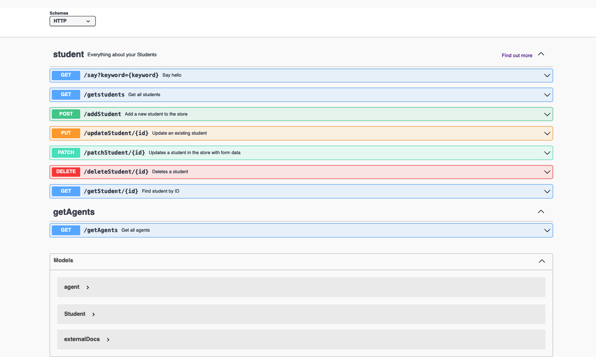
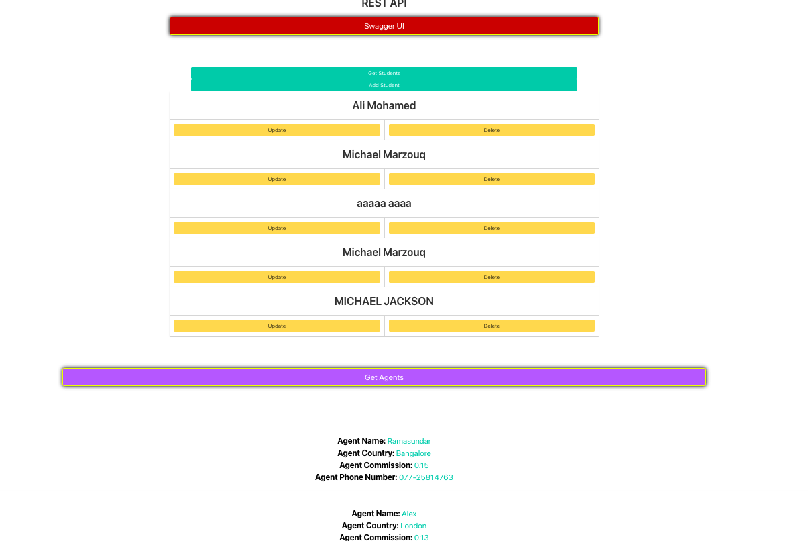

# ITIS-6177 Assignment 7 (REST API & Swagger)

 ﴃ Azure for Students [ CLI ] 
▓   dashm       RESTAPI   main ↑1  ?1  ❯  cat ../../ITIS-6177---Assignment-06/README.md 

<h1 align="center">   Systems Integration </h1>

# Description

-  This Repo is for the Systems Integration Class.

    
    

# Lincese
-  MIT
